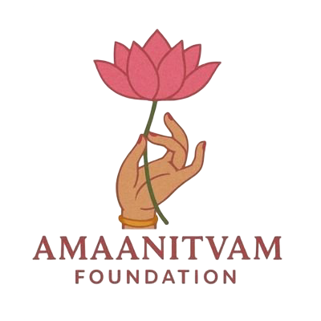
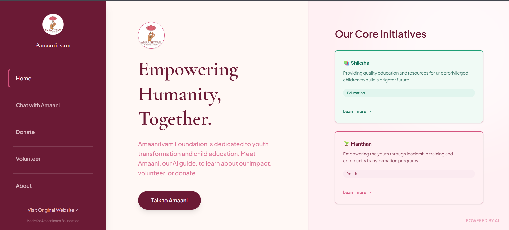
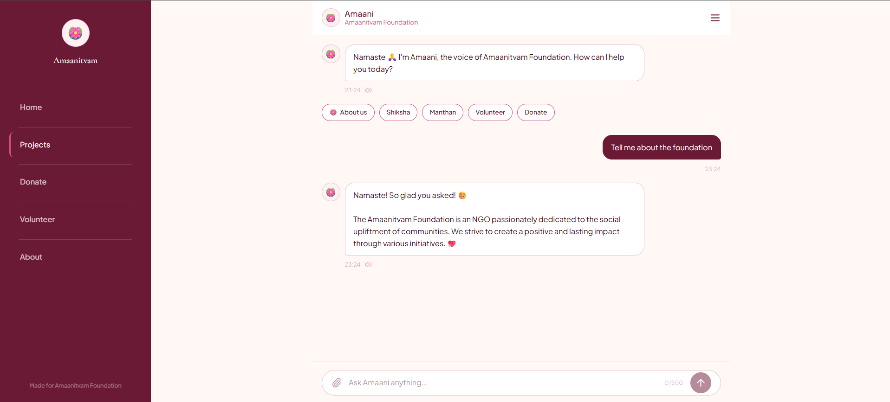

<div align="center">
  
  <h1 align="center">Amaanitvam Foundation</h1>
  <p align="center">
    <strong>An AI-Powered NGO Chatbot & Landing Page</strong>
  </p>
  
  <p align="center">
    
    
    
    
  </p>
</div>

<br />

## 🌟 Overview

Welcome to the **Amaanitvam Foundation** web experience. This project was built to automate inquiries for the NGO's flagship initiatives (*Shiksha* and *Manthan*) while providing a stunning, premium user experience.

At its core sits **Amaani**, an intelligent virtual assistant powered by **Gemini 2.5 Flash**, capable of answering questions, guiding volunteers, and even speaking its responses out loud using native browser voice synthesis.

---

## ✨ Features That Stand Out

- 🧠 **Context-Aware AI Chatbot:** Powered by Google's Gemini 2.5 Flash. Amaani knows all about the foundation and stays strictly in character.
- 🗣️ **Voice Synthesis (TTS):** Includes a native text-to-speech engine that cleans up markdown and reads AI responses out loud seamlessly.
- 💅 **Premium 120 FPS UI:** A glassmorphism-inspired split-screen Hero layout with dynamic gradients and blur effects.
- 🎬 **Micro-Animations:** Fully animated using `framer-motion` (spring physics, staggered entry chips, hover scaling).
- 📝 **Markdown Parsing:** The AI's responses are dynamically parsed to render **bold** text and lists beautifully.
- 📱 **Fully Responsive:** Dedicated Mobile and Desktop views ensuring a perfect experience on any device.
- 🛡️ **Graceful Fallbacks:** If the AI API key is missing, the backend smoothly falls back to a mock-response system so demos never break.

---

## 🛠️ Tech Stack

| Technology | Description |
| :--- | :--- |
| **React + Vite** | Blazing fast frontend framework |
| **Tailwind CSS** | Utility-first styling for the premium UI |
| **Framer Motion** | Physics-based micro-animations |
| **Node.js & Express** | Lightweight, robust backend API |
| **Google Gen AI** | `@google/genai` SDK for Gemini integration |

---

## 🚀 Getting Started

Follow these steps to run the project locally on your machine.

### 1. Clone the Repository
```bash
git clone https://github.com/swaraj3092/amaanitvam.git
cd amaanitvam
```

### 2. Start the Backend (AI Brain)
```bash
cd backend
npm install
```
*Optional but recommended:* Create a `.env` file inside the `backend` folder and add your Gemini API Key:
```env
GEMINI_API_KEY=your_api_key_here
```
Run the server:
```bash
node server.js
```
*(The backend runs on `http://localhost:5000`)*

### 3. Start the Frontend
Open a **new terminal window** and navigate to the frontend folder:
```bash
cd frontend
npm install
npm run dev
```
*(The frontend runs on `http://localhost:5173`)*

---

## 📸 Project Screenshots

<p align="center">
  
</p>

<p align="center">
  
</p>

---

<div align="center">
  <i>Built with ❤️ for the 2026 NGO Innovation Hackathon</i>
</div>
